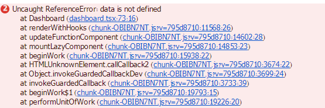
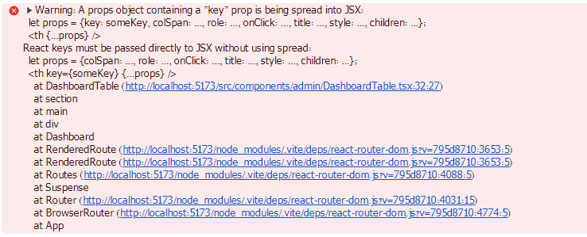
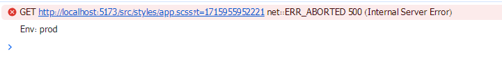

### 1 " npm create vite@latest
### 2 : npm i react-hot-toast react-icons sass firebase react-router-dom react-table
### 3 : npm i --save-dev @types/react-table
### 4 : npm run dev
### 5 : Atom One Dark Theme
Atom One Dark Theme
ES7+ React/Redux/React-Native


> Lazy Loading
    ```
    import { lazy } from "react"
    // import Home from "./pages/home"
    // import Search from "./pages/search"
    // import Cart from "./pages/cart"
    const Home = lazy(()=>import("./pages/home"))
    const Search = lazy(()=>import("./pages/search"))
    const Cart = lazy(()=>import("./pages/cart"))
    ```

### 6 : problem 28-30 min network tab er ta bujinai
> Suspanse
    ```
    import { lazy, Suspense } from "react"
        <Suspense fallback={<Loader/>}>
            <Routes>
                <Route path="/" element={<Home/>}/>
                <Route path="/search" element={<Search/>}/>
                <Route path="/cart" element={<Cart/>}/>
            </Routes>
        </Suspense>
    ```

> 32:51 / 3:05:30
    Adding Admin DashBoard
    data is not defined
    

> Jegulu dorkar nai segulu sora nur jonno click koro
    Alt + Shift + O
    
    


> 42:44 / 3:05:30
    Adding Header UI
    ```
    import { FaSearch, FaShoppingBag } from "react-icons/fa"
    import { Link } from "react-router-dom"
    const Header = () => {
    return (
        <nav>
            <Link to={"/"}>Home</Link>
            <Link to={"/search"}><FaSearch/></Link>
            <Link to={"/cart"}><FaShoppingBag/></Link>
        </nav>
    )
    }
    export default Header
    ```

> 46:28 / 3:05:30
    user login or not
    ```
            {
            user?._id ? (
                <>
                </>
            )         : (
                <Link to={"/login"}><FaSignInAlt/></Link>
            )
        }
    ```


> 59:27 / 3:05:30
    Home UI & Product Card


> 1:19:22 / 3:05:30
    Cart UI